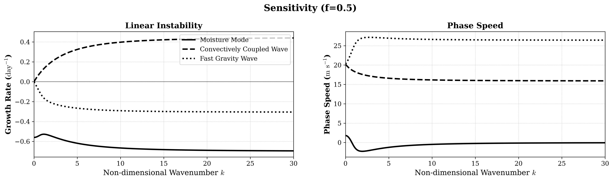
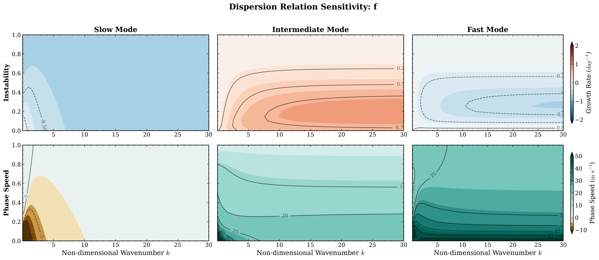
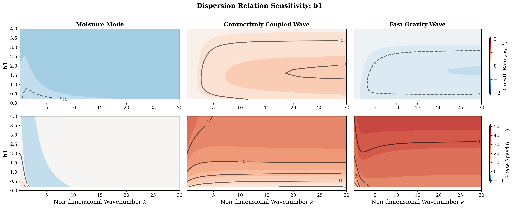
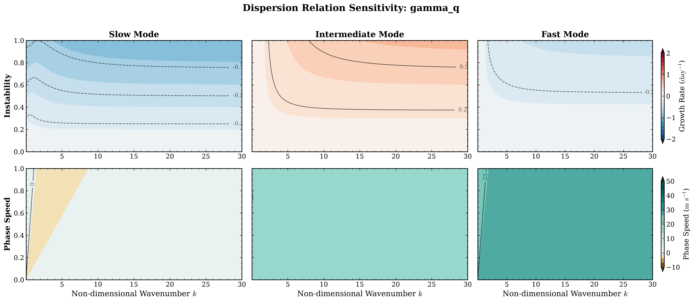
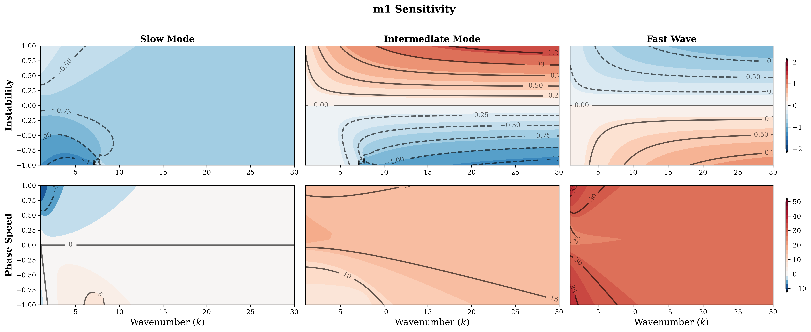
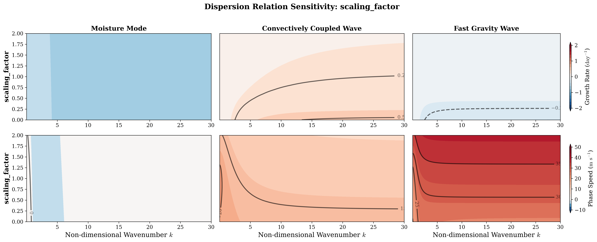

<!-- _class: lead -->

# Dispersion Relation with CRI

Report Date: 2026/07/02

---

## Content

- Intro.
- Default
- Sensitivity test
- Deduction of Dispersion Relation

---

## Introduction

This slide is to document sensitivity test of deduction in parameter space, and also asymptote analysis.

Analytical form of dispersion relation is documented in [this file](CRI_dispersion_Relation.md). The dispersion relation is a cubic polynomial, covering all the disturbances in this system, including fast gravity wave, convectively coupled wave, and moisture mode, according to Fuch and Raymond (2007).

---

## Default Configuration

- For dynamics and thermodynamics, $\tau_J$, $\epsilon$, $b_2$ are set as $0$, i.e. the damping in high frequency disturbances would vanished, the rest of configurations follow the configuration in Kuang (2008).
- For radiative heating rate, coefficients is scaled down by 0.1.
- This system should have three roots as documented in Fuch and Raymond (2007).

---

## Default Experiment

All radiation components.

Only first mode $\rightarrow$ second mode is considered.

---

## Change $f$

---

## Change $b_1$

---

## Change $\gamma_q$

---

## Change $m_1$

---

## Change $m_2$

---

## Change Radiative Heating Rate

