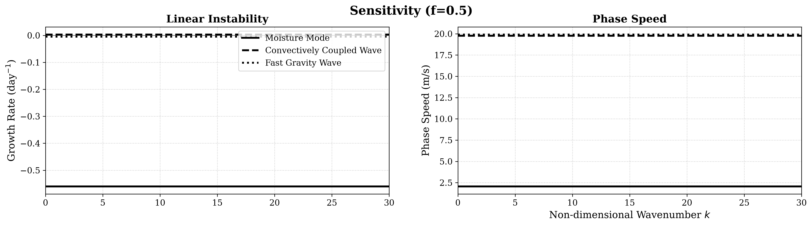
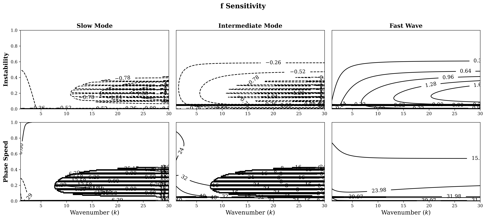
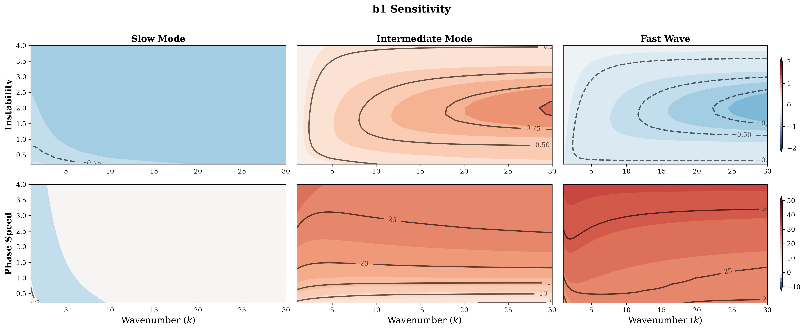
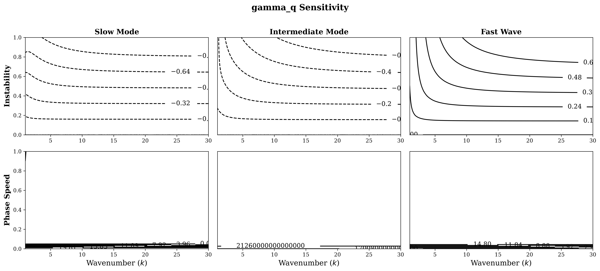
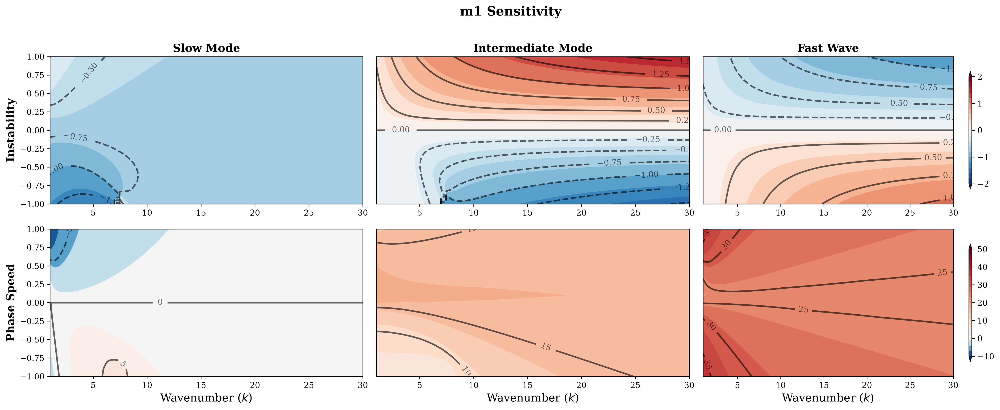
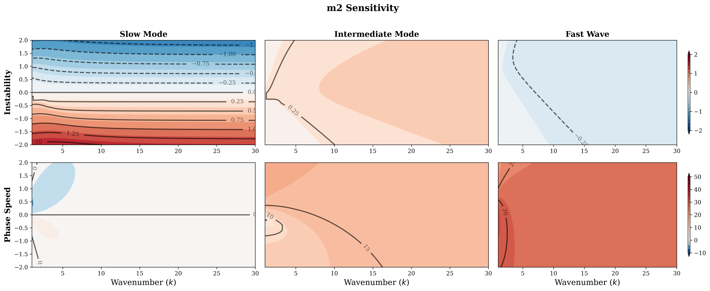
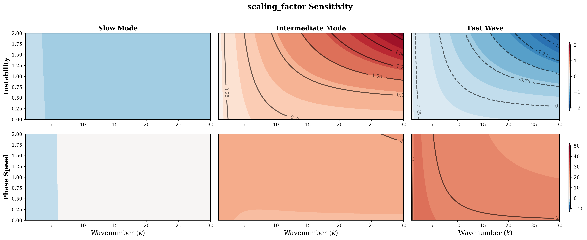

<!-- _class: lead -->

# Dispersion Relation with CRI

Report Date: 2026/07/02

---

## Content

- Intro.
- Default
- Sensitivity test
- Deduction of Dispersion Relation

---

## Introduction

This slide is to document sensitivity test of deduction in parameter space, and also asymptote analysis.

Analytical form of dispersion relation is documented in [this file](CRI_dispersion_Relation.md). The dispersion relation is a cubic polynomial, covering all the disturbances in this system, including fast gravity wave, convectively coupled wave, and moisture mode, according to Fuch and Raymond (2007).

---

## Default Configuration

- For dynamics and thermodynamics, $\tau_J$, $\epsilon$, $b_2$ are set as $0$, i.e. the damping in high frequency disturbances would vanished, the rest of configurations follow the configuration in Kuang (2008).
- For radiative heating rate, coefficients is scaled down by 0.1.
- This system should have three roots as documented in Fuch and Raymond (2007).

---

## Default Experiment

There are three types of disturbances in this system, moisture mode, convectively couple wave, and fast gravity wave are classified through their own phase speed, which follows Fuch and Raymond (2007).

---

## Change $f$

---

## Change $b_1$

---

## Change $\gamma_q$

---

## Change $m_1$

---

## Change $m_2$

---

## Change Radiative Heating Rate

---

## Deduction

Original equation set is simplified by assuming $\varepsilon=0$, $b_2 = 0$, and SQE:
$$
\begin{align}
    \frac{\partial T_1}{\partial t} + c_1 \frac{\partial T_1}{\partial x} &= J_1 + \alpha_{1, 1} c_1 \frac{\partial T_1}{\partial x} + \alpha_{1, 2} c_2 \frac{\partial T_2}{\partial x}\\
    \frac{\partial T_2}{\partial t} + c_2 \frac{\partial T_2}{\partial x} &= J_2 + \alpha_{2, 1} c_1 \frac{\partial T_1}{\partial x} + \alpha_{2, 2} c_2 \frac{\partial T_2}{\partial x}\\
    \frac{\partial q}{\partial t} &= m_1 J_1 + m_2 J_2\\
    J_1 &= -\frac{F}{b_1} \frac{\partial}{\partial t}\left[ fT_1 + (1-f) T_2 \right]\\
    J_2 &= -\gamma_q q
\end{align}
$$

where $w_j = c_j \frac{\partial T_j}{\partial x}$

---

Using the basis $\exp\left( i\omega t - ikx  \right)$, the equations above is polarized as:

$$
\begin{align}
    i\omega T_1 - i k c_1 T_1 &= J_1  -i k c_1 \alpha_{1, 1} T_1 - i k c_2 \alpha_{1, 2} T_2\\
    i\omega T_2 - i k c_2 T_2 &= J_2  -i k c_1 \alpha_{2, 1} T_1 - i k c_2 \alpha_{2, 2} T_2\\
    i\omega q &= m_1 J_1 + m_2 J_2 \\
    J_1  &= -\frac{F}{b_1} (i\omega) \left[f T_1 + (1-f) T_2\right] \\
    J_2 &= -\gamma_q q
\end{align}
$$

---

With sorting the equations, the system becomes:

$$
\begin{cases}
    i\omega T_1 - i k c_1 T_1 &= -\frac{F}{b_1} (i\omega) \left[f T_1 + (1-f) T_2\right]  -i k c_1 \alpha_{1, 1} T_1 - i k c_2 \alpha_{1, 2} T_2\\
    i\omega T_2 - i k c_2 T_2 &= -\gamma_q q  -i k c_1 \alpha_{2, 1} T_1 - i k c_2 \alpha_{2, 2} T_2\\
    i\omega q &= m_1 \left( -\frac{F}{b_1} (i\omega) \left[f T_1 + (1-f) T_2\right] \right) - m_2 \gamma_q q
\end{cases}
$$

$$
⇒ \begin{cases}
    (i\omega) \left[ \left(1 + \frac{F}{b_1} f\right) T_1 + \frac{F}{b_1} (1-f) T_2 \right] &= ikc_1 \left( 1 - \alpha_{1, 1} \right) T_1 - ikc_2 \alpha_{1, 2} T_2\\
    (i\omega) T_2 &= -i k c_1 \alpha_{2, 1} T_1 + ikc_2 (1-\alpha_{2, 2}) T_2 - \gamma_q q \\
    (i\omega) \left[ \frac{F}{b_1} f m_1 T_1 + \frac{F}{b_1} (1-f)m_1 T_2 + q \right] &= -m_2 \gamma_q q
\end{cases}
$$

---

$$
⇒ (i\omega)
\underbrace{\begin{pmatrix}
    1 + \frac{F}{b_1} f & \frac{F}{b_1} (1-f) & 0 \\
    0 & 1 & 0 \\
    \frac{F}{b_1} f m_1 & \frac{F}{b_1} (1-f) m_1 & 1
\end{pmatrix}}_{\mathbf{M}} \begin{pmatrix}
    T_1 \\ T_2 \\ q
\end{pmatrix} = \underbrace{\begin{pmatrix}
    ikc_1 (1-\alpha_{1, 1}) & -ikc_2 \alpha_{1, 2} & 0\\
    -ikc_1 \alpha_{2, 1} & ikc_2 (1-\alpha_{2, 2}) & -\gamma_q \\
    0 & 0 & -m_2 \gamma_q
\end{pmatrix}}_{\mathbf{L}}\begin{pmatrix}
    T_1 \\ T_2 \\ q
\end{pmatrix}
$$

$$
⇒ i\omega\mathbf{M} \; \vec{v} = 𝐋 \; \vec{v} ⇒ \left( i\omega\mathbf{M} - 𝐋 \right)\;\vec{v} = \vec{0}
$$

For non-trivial solution, $\det\left(i\omega 𝐌 - 𝐋 \right)=0$, by letting $\beta_1 = \frac{F}{b_1}f$ and $\beta_2 = \frac{F}{b_1} (1-f)$, the determinant is expanded as:

$$
-\gamma_q \mathcal{M}_{23} + (i\omega + m_2\gamma_q) \mathcal{M}_{33} = 0
$$

where $\mathcal{M}_{23}$ and $\mathcal{M}_{33}$ are the corresponding $2 × 2$ minors.

---

$$
\mathcal{M}_{23} = \det\begin{pmatrix}
i\omega(1 + \beta_1) - ikc_1(1-\alpha_{1,1}) & i\omega\beta_2 + ikc_2\alpha_{1,2} \\
i\omega\beta_1 m_1 & i\omega\beta_2 m_1
\end{pmatrix}
$$

Expanding the minor:
$$
\mathcal{M}_{23} = \left[ i\omega(1 + \beta_1) - ikc_1(1-\alpha_{1,1}) \right](i\omega\beta_2 m_1) - \left[ i\omega\beta_2 + ikc_2\alpha_{1,2} \right](i\omega\beta_1 m_1)
$$

Distributing and grouping by powers of $i\omega$:
$$
\mathcal{M}_{23} = (i\omega)^2 m_1 \beta_2 (1 + \beta_1 - \beta_1) - (i\omega) ik m_1 \left[ c_1(1-\alpha_{1,1})\beta_2 + c_2\alpha_{1,2}\beta_1 \right]
$$

$$
\mathcal{M}_{23} = (i\omega)^2 m_1 \beta_2 - (i\omega) ik m_1 \left[ c_1(1-\alpha_{1,1})\beta_2 + c_2\alpha_{1,2}\beta_1 \right]
$$

---

$$
\mathcal{M}_{33} = \det\begin{pmatrix}
i\omega(1 + \beta_1) - ikc_1(1-\alpha_{1,1}) & i\omega\beta_2 + ikc_2\alpha_{1,2} \\
ikc_1\alpha_{2,1} & i\omega - ikc_2(1-\alpha_{2,2})
\end{pmatrix}
$$

Expanding the minor and applying $(ik)^2 = -k^2$:
$$
\mathcal{M}_{33} = \left[ i\omega(1 + \beta_1) - ikc_1(1-\alpha_{1,1}) \right]\left[ i\omega - ikc_2(1-\alpha_{2,2}) \right] - \left[ i\omega\beta_2 + ikc_2\alpha_{1,2} \right](ikc_1 \alpha_{2,1})
$$

Grouping by powers of $i\omega$:
$$
\begin{align}
\mathcal{M}_{33} = (i\omega)^2(1 + \beta_1) &- (i\omega) ik \left[ c_2(1-\alpha_{2,2})(1 + \beta_1) + c_1(1-\alpha_{1,1}) + c_1\alpha_{2,1}\beta_2 \right] \\
&- k^2 c_1 c_2 \left[ (1-\alpha_{1,1})(1-\alpha_{2,2}) - \alpha_{1,2}\alpha_{2,1} \right]
\end{align}
$$

Let the dry structural determinant be $\Delta_\alpha = (1-\alpha_{1,1})(1-\alpha_{2,2}) - \alpha_{1,2}\alpha_{2,1}$.

$$
\mathcal{M}_{33} = (i\omega)^2(1 + \beta_1) - (i\omega) ik \left[ c_2(1-\alpha_{2,2})(1 + \beta_1) + c_1(1-\alpha_{1,1}) + c_1\alpha_{2,1}\beta_2 \right] - k^2 c_1 c_2 \Delta_\alpha
$$

---

Substitute $\mathcal{M}_{23}$ and $\mathcal{M}_{33}$ back into the characteristic equation:
$$
-\gamma_q \mathcal{M}_{23} + (i\omega + m_2\gamma_q) \mathcal{M}_{33} = 0
$$

By distributing $(i\omega + m_2\gamma_q)$ across $\mathcal{M}_{33}$ and grouping all terms by the order of $(i\omega)$, we isolate the coefficients for the general cubic characteristic equation:

$$\mathcal{C}_3 (i\omega)^3 + \mathcal{C}_2 (i\omega)^2 + \mathcal{C}_1 (i\omega) + \mathcal{C}_0 = 0$$

**Leading Order ($\mathcal{O}((i\omega)^3)$):**
$$\mathcal{C}_3 = 1 + \beta_1$$

**Second Order ($\mathcal{O}((i\omega)^2)$):**
$$\mathcal{C}_2 = \gamma_q \left[ m_2 (1 + \beta_1) - m_1 \beta_2 \right] - ik \left[ c_2(1-\alpha_{2,2})(1+\beta_1) + c_1(1-\alpha_{1,1}) + c_1\alpha_{2,1}\beta_2 \right]$$

---

**First Order ($\mathcal{O}((i\omega)^1)$):**
$$
\begin{aligned}
\mathcal{C}_1 &= -k^2 c_1 c_2 \Delta_\alpha \\
&\quad - ik \gamma_q \Big\{ m_2 \big[ c_2(1-\alpha_{2,2})(1+\beta_1) + c_1(1-\alpha_{1,1}) + c_1\alpha_{2,1}\beta_2 \big] \\
&\quad\quad\quad\quad\quad - m_1 \big[ c_1(1-\alpha_{1,1})\beta_2 + c_2\alpha_{1,2}\beta_1 \big] \Big\}
\end{aligned}
$$

**Zeroth Order ($\mathcal{O}((i\omega)^0)$):**
$$\mathcal{C}_0 = - k^2 m_2\gamma_q c_1 c_2 \Delta_\alpha$$
