<!-- _class: lead -->

# Dispersion Relation with CRI

Period: 2026/06/16 ~

---

# Content

 - Intro.
 - Default
 - Change $f$
 - Filtering high frequency
 - Modify moisture advection

---

# Intro.

This slide is to document sensitivity test of deduction in parameter space, and also asymptote analysis.

Analytical form of dispersion relation is documented in [this file](CRI_dispersion_Relation.md). The dispersion relation is a cubic polynomial, covering all the disturbances in this system, including fast gravity wave, convectively coupled wave, and moisture mode, according to Fuch and Raymond (2007).

---

# Default Configuration

 - For dynamics and thermodynamics, $\tau_J$, $\epsilon$, $b_2$ are set as $0$, i.e. the damping in high frequency disturbances would vanished, the rest of configurations follow the configuration in Kuang (2008).
 - For radiative heating rate, coefficients is scaled down by 0.1.
 - This system should have three roots as documented in Fuch and Raymond (2007).

---

# Default Experiment

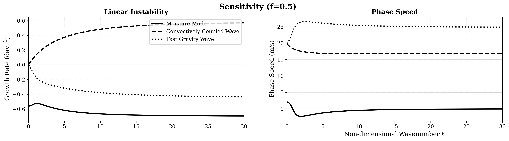

There are three types of disturbances in this system, moisture mode, convectively couple wave, and fast gravity wave are classified through their own phase speed, which follows Fuch and Raymond (2007). 

---

# Change $f$ -- Instability

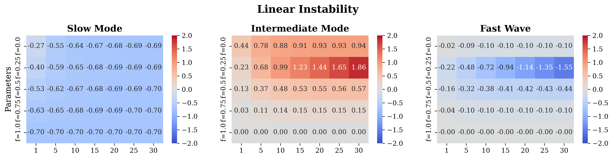

The classification is made by phase speed at default setting ($f=0.5$).

---

# Change $f$ -- Phase Speed

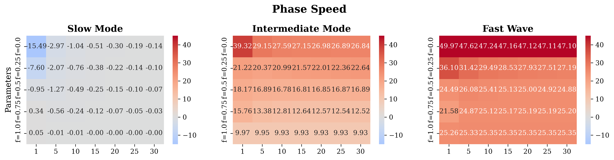

---

# Change $b_1$ -- Instability

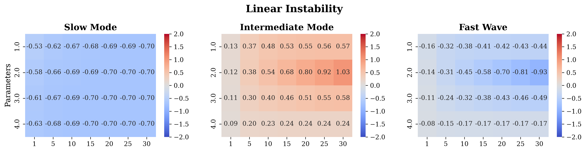

---

# Change $b_1$ -- Phase Speed

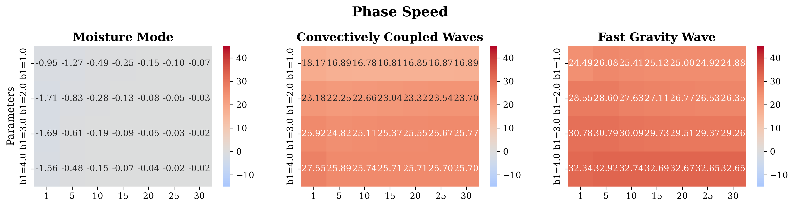

---

# Change $\gamma_q$ -- Instability

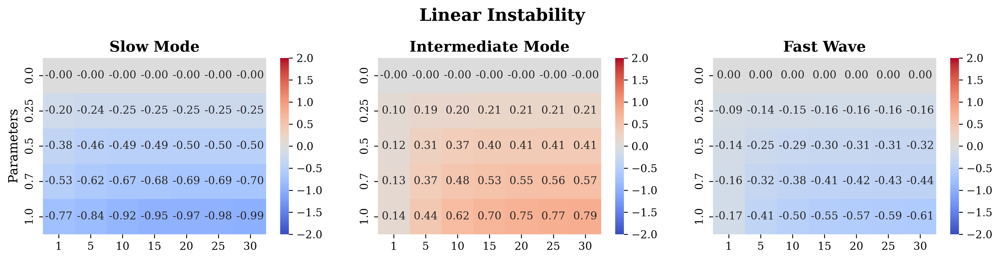

---

# Change $\gamma_q$ -- Phase Speed

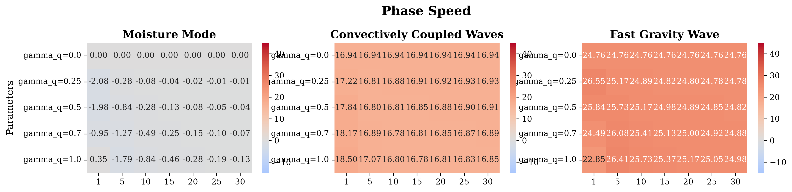

---

# Change $m_1$ -- Instability

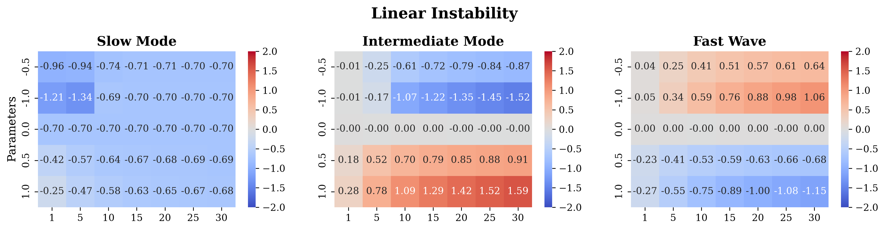

---

# Change $m_1$ -- Phase Speed

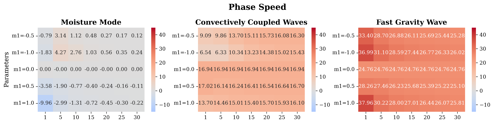

---

# Change $m_2$ -- Instability

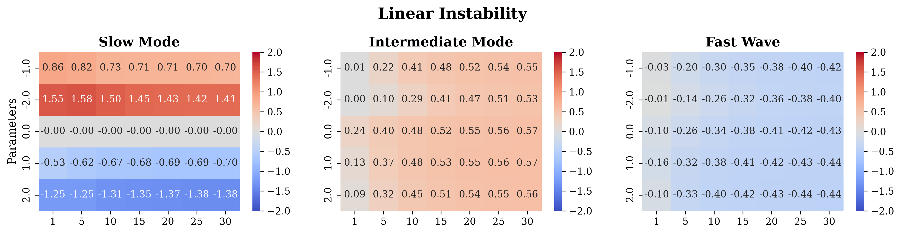

---

# Change $m_2$ -- Phase Speed

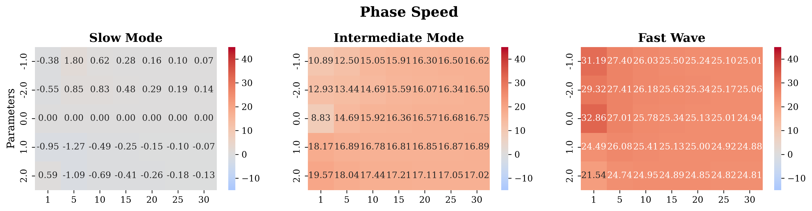

---

# Change radiative heating instensity -- Instability

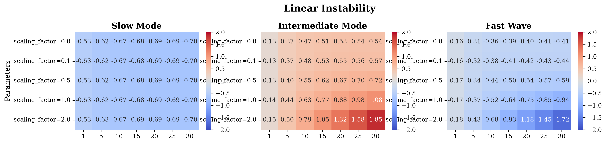

---

# Change radiative heating instensity -- Phase Speed

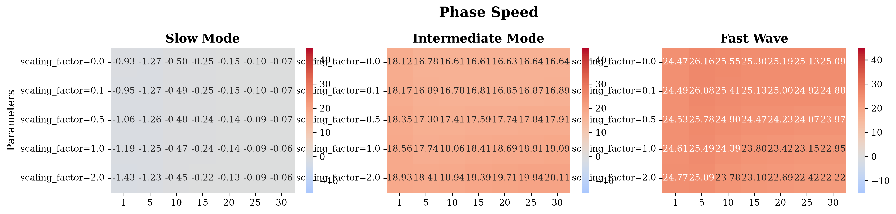